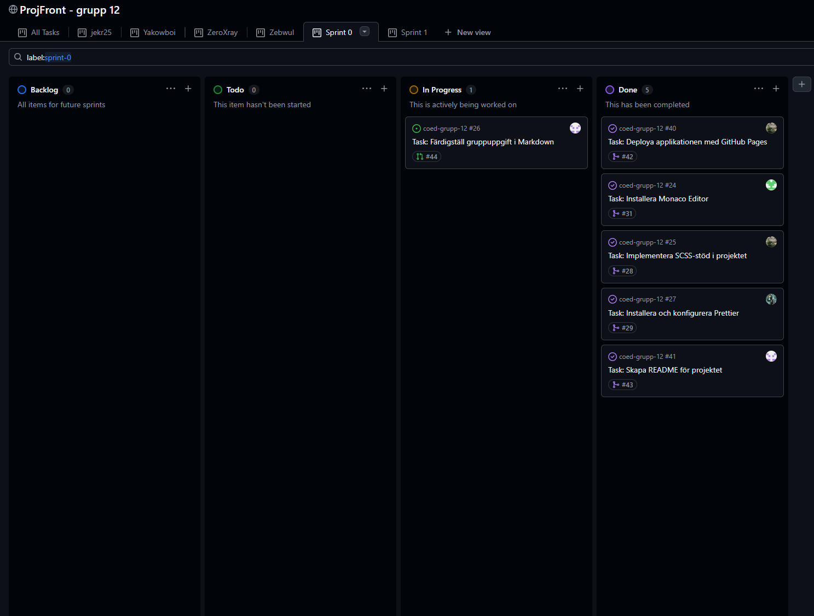
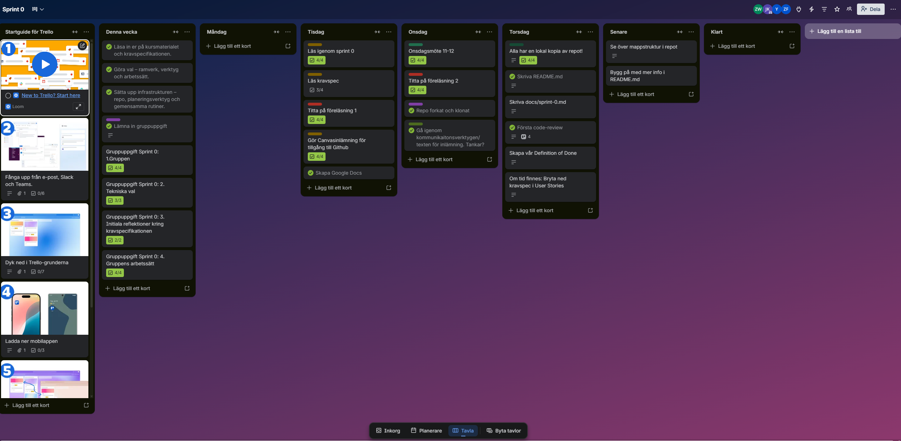

# 1. The Group

## Group name and number in Canvas (e.g. "Team 4")

Team 12

## Group members and GitHub usernames

- Jenny Krusevall, jekr25
- Arian Nawas, Yakowboi
- Niklas Gustafsson, ZeroXray404
- Zebastian Wulff, Zebwul

## Link to your GitHub repo

https://github.com/Zebwul/coed-grupp-12

## Link to your planning tool (GitHub Projects, Trello, or similar)

Trello:
https://trello.com/w/userarbetsyta83338518

GitHub Projects:
https://github.com/users/Zebwul/projects/2

# 2. Technical Choices

## Selected frontend framework and rationale (even if you chose the recommended one)

React:
We chose to work with React because it feels relevant to the job market and is likely to remain in demand. It also does not feel like too large a step to learn since we have previously worked with JavaScript.

## Selected code editor library and rationale (even if you chose the recommended one)

Monaco:
We chose Monaco because it is widely used and open source. Those are two strong reasons for us to learn it. It also works in all major browsers. We also expect Monaco to support all core functionality required by the assignment, which might not be the case in lighter editor libraries.

## Other technical choices you have made or discussed, for example a CSS framework, icon library, etc.

Sass:
We chose to use Sass because it provides more functionality than regular CSS files. It is also relatively easy to read.

Icon libraries:
We chose to limit ourselves to the two libraries Lucide and Ionicons.

Fonts:
We discussed the possibility of using the Google Fonts Ubuntu, Nunito, or Inter.

Console font:
We discussed the possibility of using the console font Consolas from Adobe Fonts.

ESLint:
We will use ESLint as our code linter.

Prettier:
We will use Prettier as our formatter.

Socket.io-client:
Socket.IO dependencies will be added early in Sprint 1.

# 3. Initial Reflections on the Requirements Specification

## What is unclear or lacks sufficient detail?

Nothing. The requirements specification is well structured and easy to understand. The requirements are clearly written, which makes them easy to convert into tasks and user stories.

## Are there any requirements that already seem complex or risky?

As a group, we are all somewhat behind in parts of earlier courses, which means that several parts of this course will be new to all of us. That increases the risk and complexity for the group.

# 4. Team Working Process

## How do you plan to communicate within the group?

Our communication will be based on GitHub Flow. This means that our work will follow a defined process. We use `main` as the branch that contains all approved files in the application. Whenever we start a new task derived from a user story, we always create a new branch. When a task or issue is finished, we create a pull request (PR), which also allows us to automate updates to the project board. A PR must always be reviewed before it is merged into `main`. This helps us maintain quality by validating the work and helping each other uphold a solid code standard.

We use several tools for communication:

### Discord

Used as the central hub for communication.
A large part of our day-to-day communication happens in a Discord chat.
Discord also works as a documentation library.
We collect links there to the tools we use, such as Google Docs, suggested tools, and Whiteboard.
We also have a channel for documenting decisions made within the group.

### Discord Whiteboard

Used to make discussion more effective, since it allows us to brainstorm and share or present ideas more easily.

### Google Docs

We write shared submissions there before finalizing them elsewhere.
The tool can also be used to take notes during meetings.

### Planning Boards

We use two different planning boards for different purposes.

GitHub Projects:
All work items connected to the requirements specification, user stories, and tasks will be added here, assigned to a developer, and time-estimated.

Trello:
We created a shared workspace and plan to work in one board per sprint.
In Trello we add planned meetings with agendas. Everyone can add points or cards for topics they want to raise in the next meeting.
We also collect cards describing what needs to be submitted during the sprint, anything that needs to be read, or videos that everyone should watch. Each team member can then use this as a checklist.
We keep items there that are not directly tied to the requirements specification and tasks, but still need to be tracked or completed.

### Google Calendar

We add all planned meetings here, such as sprint planning meetings, daily standups, and retrospective meetings.

## How will you distribute work?

We will break down the requirements specification into different user stories. We will then turn them into tasks with acceptance criteria, estimate the time required, and assign them to one of the group members.

## Do you have a plan for what happens if the collaboration does not work as intended? Do you have an agreement for how the collaboration should work?

We will hold daily standups to see how things are going for everyone, and asynchronous daily standups for anyone who cannot attend the scheduled voice-call standup on Discord.
We respect each other and assume that everyone takes responsibility for their own work. We are all relatively busy, so a lot of our time also goes to work, family, meetings, and so on. Because of that, we focus on communicating openly about how things are going and helping each other if someone gets stuck.

## Which planning tool did you choose and why?

We started with Trello because it was easy to get started with and gave us a quick shared overview of what needed to be done in Sprint 0. We would like to use GitHub Projects once we start working with tasks in Sprint 1 and onward, because a task in GitHub Projects can be connected to the work we do in GitHub.
We believe the two tools can complement each other for different purposes, so we plan to use both Trello and GitHub Projects.

## Backlog

Final state of the backlog and Trello board:

### GitHub Projects

### Trello

