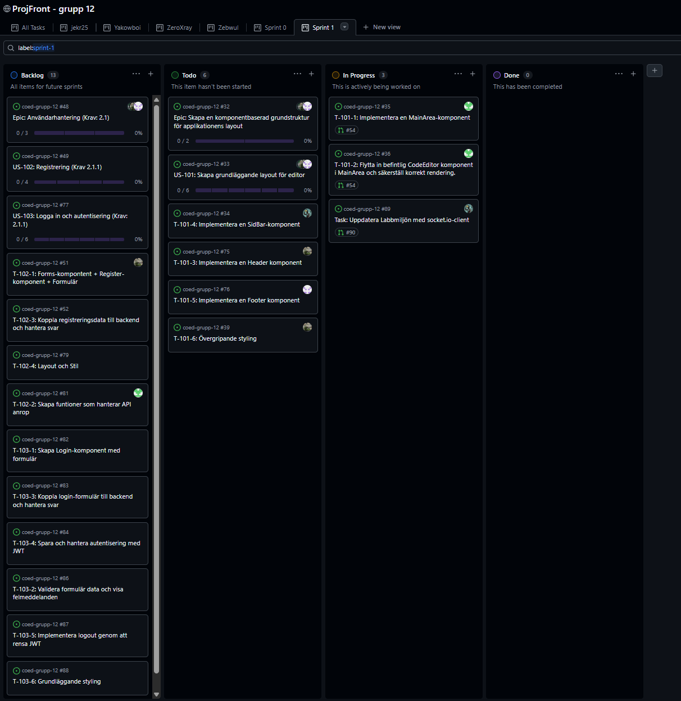
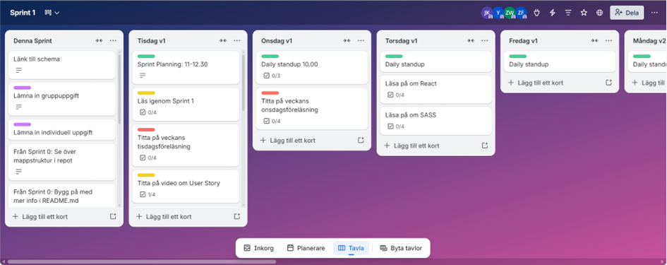
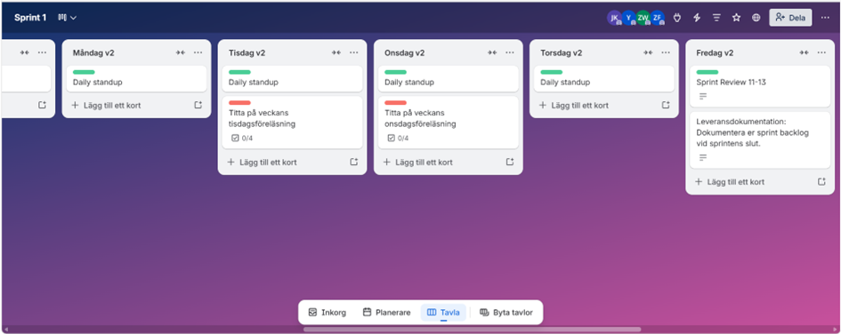
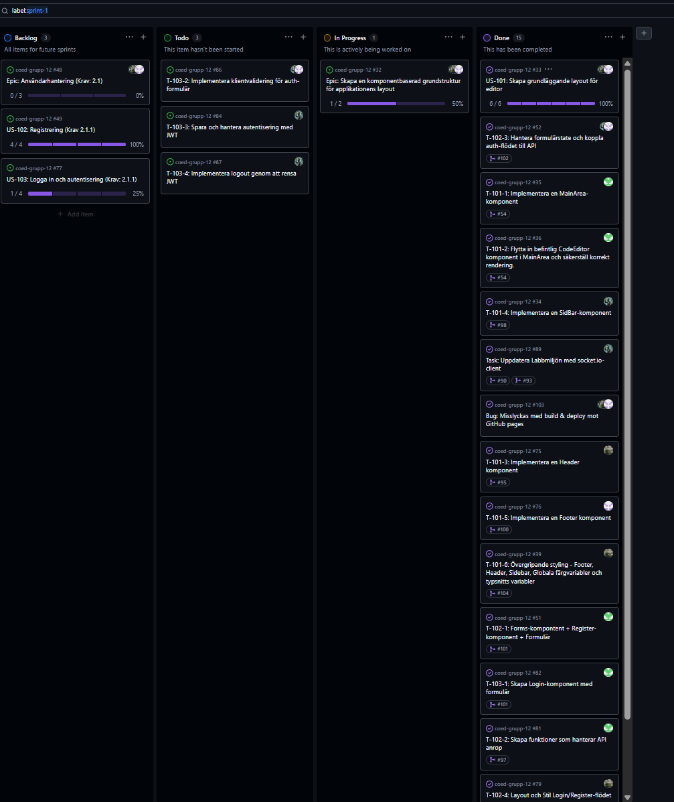

# 1. Sprint Planning Documentation

## Sprint Goal

The main goal of this sprint was first to make sure that our working process was in place and documented, and then to begin sprint planning with the goal of starting to build CoEd during the second sprint week, with a maximum of 15 hours of work per person.

## Selected User Stories

We chose to create user stories for a basic CoEd layout first. After that, we selected user stories for user functionality. The user stories connected to Sprint 1 are:

- 1: US-101: Create a basic editor layout
  - "As a user, I want a clear and divided workspace with a navbar, footer, file panel, and code editor so that the layout is easy to understand and navigate."
- 2: US-102: Registration (Requirement 2.1.1)
  - "As a new user, I want to register an account so that I can log in."
- 3: US-103: Login and authentication (Requirement 2.1.1)
  - "As a user, I want to click a button to log in so that I can access my workspace."

## Tasks

The following tasks were completed for US-101:

- T-101-1: Implement a `MainArea` component
- T-101-2: Move the existing `CodeEditor` component into `MainArea` and ensure correct rendering
- T-101-3: Implement a `Header` component
- T-101-4: Implement a `SideBar` component
- T-101-5: Implement a `Footer` component
- T-101-6: Overall styling for footer, header, sidebar, global color variables, and font variables

The following tasks were completed for US-102:

- T-102-1: `Forms` component + `Register` component + form
- T-102-2: Create functions that handle API requests
- T-102-3: Handle form state and connect the auth flow to the API
- T-102-4: Layout and styling for the login/register flow

## Distribution and Estimates

**US-101:**

| Task    | Sprint | Estimate | Actual time | Name   |
| ------- | ------ | -------- | ----------- | ------ |
| T-101-1 | 1      | ~2h      | ~2h         | Zeb    |
| T-101-2 | 1      | ~1h      | ~2h         | Zeb    |
| T-101-3 | 1      | ~2h      | ~3h         | Arian  |
| T-101-4 | 1      | ~2h      | ~6h         | Niklas |
| T-101-5 | 1      | ~2h      | ~5h         | Jenny  |
| T-101-6 | 1      | ~2h      | ~4h         | Arian  |

Estimated time: 11h 
Actual time: 22h

**US-102:**

| Task    | Sprint | Estimate | Actual time | Name   |
| ------- | ------ | -------- | ----------- | ------ |
| T-102-1 | 1      | ~6h      | ~6h         | Zeb    |
| T-102-2 | 1      | ~8h      | ~5h         | Zeb    |
| T-102-3 | 1      | ~6h      | ~7h         | Niklas |
| T-102-4 | 1      | ~4h      | ~4h         | Arian  |

Estimated time: 24h 
Actual time: 22h

## Acceptance Criteria

**US-101:**

- Given that the application is started, 
  When the page loads, 
  Then a layout with a file panel, editor, footer, and navbar should be displayed.
   
- Given that the page is rendered, 
  When I look at the workspace, 
  Then the file panel should be placed to the left of the editor area. 
  Then the editor area should be placed to the right of the file panel. 
  Then the navbar should be placed at the top of the page. 
  Then the footer should be placed at the bottom of the page.
   
- Given that the layout is displayed, 
  When I resize the browser window, 
  Then the panels should be responsive and adapt without breaking the layout.

**US-102:**

- Given that I do not have an account, 
  When I click log in, 
  Then there should be a button that takes me to the registration page.
   
- Given that I do not have an account, 
  When I click log in without an existing account, 
  Then I should automatically be redirected to the registration page.
   
- Given that I enter a valid email and password, 
  When I register, 
  Then the account should be created.
   
- Given that I enter an invalid email or password, 
  When I try to register, 
  Then error messages should be shown.

## Backlog

Initial state of the backlog and Trello board:

### GitHub Projects

### Trello

# 2. Delivery Documentation

### Completed and Started User Stories

#### The following user stories were completed during the sprint:

US-101: Create a basic editor layout 
US-102: Registration

#### The following user stories were started during the sprint:

US-103: Login and authentication (partially implemented - UI completed and validation plus API integration started)

In addition to this, time was also spent on so-called spikes (preparatory work), where everyone on the team spent varying numbers of hours, for example learning React, SASS, and how to work agilely with GitHub and GitHub Flow. The purpose was to reduce uncertainty and build as stable a foundation as possible.

## Tasks

#### The following tasks were completed during the sprint:

Task: Update the lab environment with `socket.io-client`  
Task: Implement PR checks  
T-101-1: Implement the `MainArea` component  
T-101-2: Move the existing `CodeEditor` component into `MainArea` and ensure correct rendering  
T-101-3: Implement a `Header` component  
T-101-4: Implement a `SideBar` component  
T-101-5: Implement a `Footer` component  
T-101-6: Overall styling - footer, header, sidebar, global color variables, and font variables  
T-102-1: `Forms` component + `Register` component + form  
T-102-2: Create functions that handle API requests  
T-102-3: Handle form state and connect the auth flow to the API  
T-102-4: Layout and styling for the login/register flow  
T-103-1: Create a `Login` component with a form

### Distribution of Completed Tasks

Jenny: T-101-5, T-102-3, T-103-2 
Niklas: T-101-4, Task: Update the lab environment with `socket.io-client`, T-102-3, T-103-2 
Arian: T-101-3, Task: Implement PR checks, T-101-6, T-102-4 
Zebastian: T-101-1, T-101-2, T-102-1, T-102-2, T-103-1

## Time Outcome

### US-101:

| Task    | Sprint | Estimate | Actual time | Name   |
| ------- | ------ | -------- | ----------- | ------ |
| T-101-1 | 1      | ~2h      | ~2h         | Zeb    |
| T-101-2 | 1      | ~1h      | ~2h         | Zeb    |
| T-101-3 | 1      | ~2h      | ~3h         | Arian  |
| T-101-4 | 1      | ~2h      | ~6h         | Niklas |
| T-101-5 | 1      | ~2h      | ~5h         | Jenny  |
| T-101-6 | 1      | ~2h      | ~4h         | Arian  |

Estimated time: 11h 
Actual time: 22h

### US-102:

| Task    | Sprint | Estimate | Actual time | Name   |
| ------- | ------ | -------- | ----------- | ------ |
| T-102-1 | 1      | ~6h      | ~6h         | Zeb    |
| T-102-2 | 1      | ~8h      | ~5h         | Zeb    |
| T-102-3 | 1      | ~6h      | ~7h         | Niklas |
| T-102-4 | 1      | ~4h      | ~4h         | Arian  |

Estimated time: 24h 
Actual time: 22h

### US-103:

| Task    | Sprint | Estimate | Actual time | Name |
| ------- | ------ | -------- | ----------- | ---- |
| T-103-1 | 1      | ~4h      | ~4h         | Zeb  |
| #86     | 1      | ~2h      | ~N/A        |      |
| #84     | 1      | ~6h      | ~N/A        |      |
| #87     | 1      | ~2h      | ~N/A        |      |

Estimated time: ~20h 
Actual time: ??h

## Definition of Done

#### A user story is considered complete when:

- The feature **meets** the user story's **acceptance criteria**
- The user story has **correct naming** and the task can be **traced back to the user story**
- Time estimates and **time reporting** for the task are **documented**
- The code **runs locally** **without errors**
- **Error handling** is implemented **where relevant**
- The README is updated when needed
- The **PR** description **explains what** was done and **links to a user story**
- **At least one** other group member **has reviewed** and approved the PR
- The code is merged into `main`
- The code follows the group's coding conventions:
  - Commits, code, and file names: English text
  - Body text in, for example, Trello/PR/code review: Swedish text
  - React `.jsx` files: PascalCase
  - `.js` files, variables, props: camelCase
  - CSS and SASS: kebab-case
  - Folders: lowercase

## Backlog

Final state of the backlog:

### GitHub Projects

# 3. Sprint Retrospective

## What worked well?

What worked well was that everyone took responsibility and respected each other's different schedules and availability. That made it possible for the work to keep moving without anyone needing to be pushed constantly.

We also had good communication within the group and were quick to help each other when someone got stuck, which made collaboration smoother.

## What worked less well?

One thing that worked less well was that all four of us worked on the same user story and requirement area at the same time. It became fairly messy and sometimes inefficient when everyone was working in the same areas and trying to do everything together.

We think it would have been smoother to split up, for example by working in pairs on different user stories. That way we could have worked more focused and in parallel instead of everyone being involved in every step all the time.

This is something we can improve going forward to create a better workflow.

## What will we do differently next sprint?

In the next sprint we want to formulate tasks a bit more broadly, so that we do not end up with too many small steps inside the same user story. As things have worked so far, several people can become involved in unnecessarily small parts, which makes the work less efficient.

We also want to establish a better routine for our daily standups. The idea is to keep them short, at most 15 minutes, where we quickly go through what we have done, what we are going to do, and whether there are any blockers. If something needs a more detailed discussion, we will handle it after the meeting so that the standup does not run too long.

## Actions

### Sprint Planning

We will plan our user stories and tasks so that they fit pair work. The idea is to reduce dependencies and make it easier to stay flexible as a team. To make that work, we will keep the tasks a bit more high level instead of planning every detail from the start. The pair that takes on a user story will be responsible for breaking it down into smaller parts. We will start doing this in the next sprint planning session.

### Daily Standup

We will set aside 30 minutes for the daily standup. The first 15 minutes will follow a structured Scrum-style round where everyone briefly says what they have done, what they will do, and whether they have any problems. If something is blocking progress, we will handle it outside the meeting so that the standup does not run too long.
