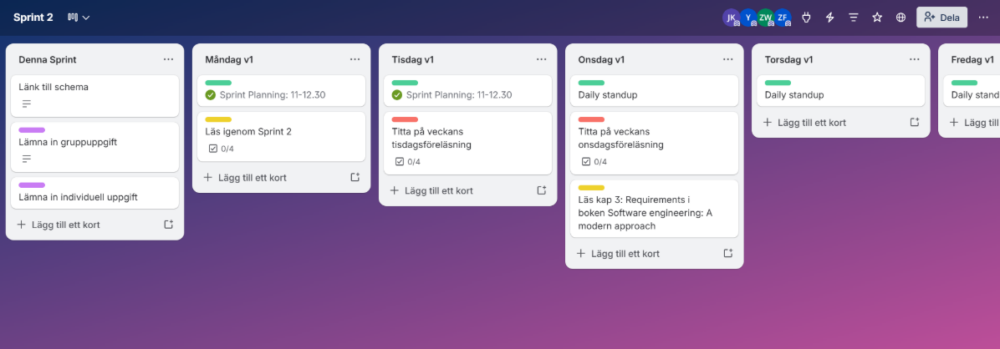
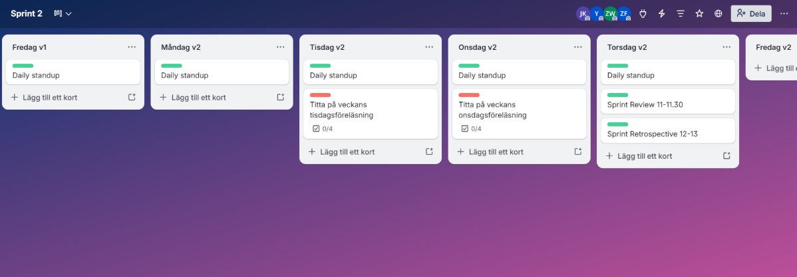
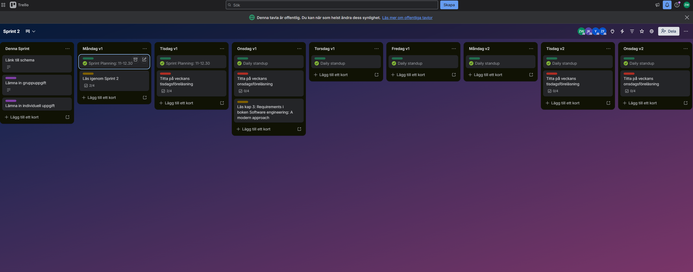
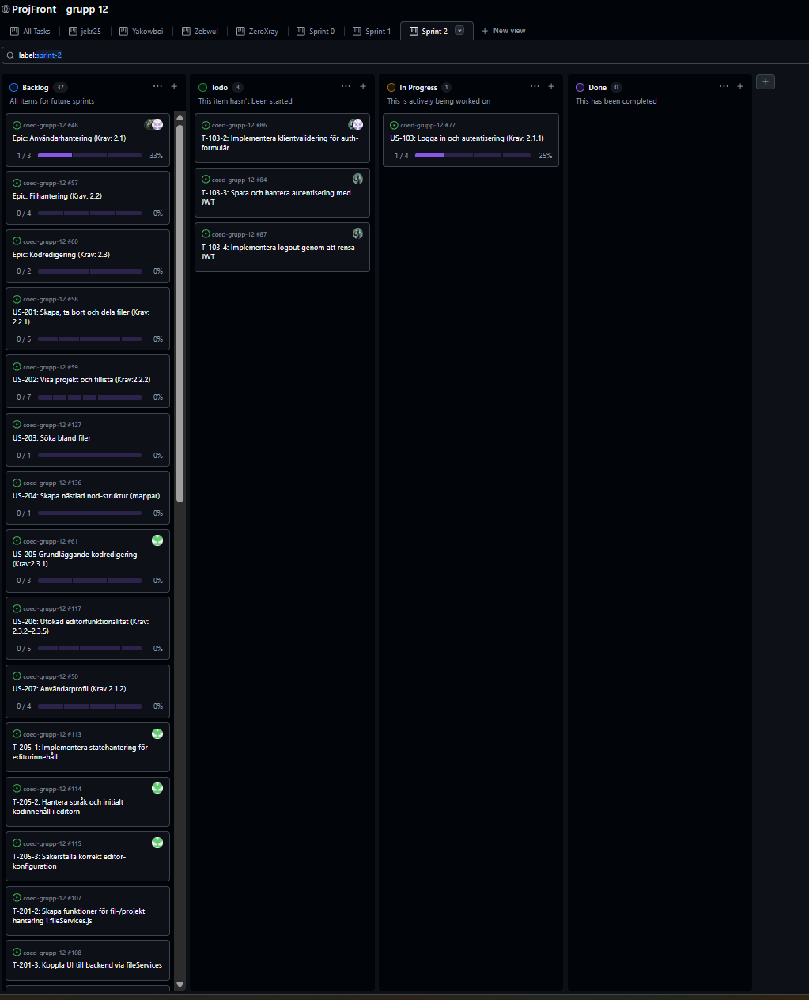
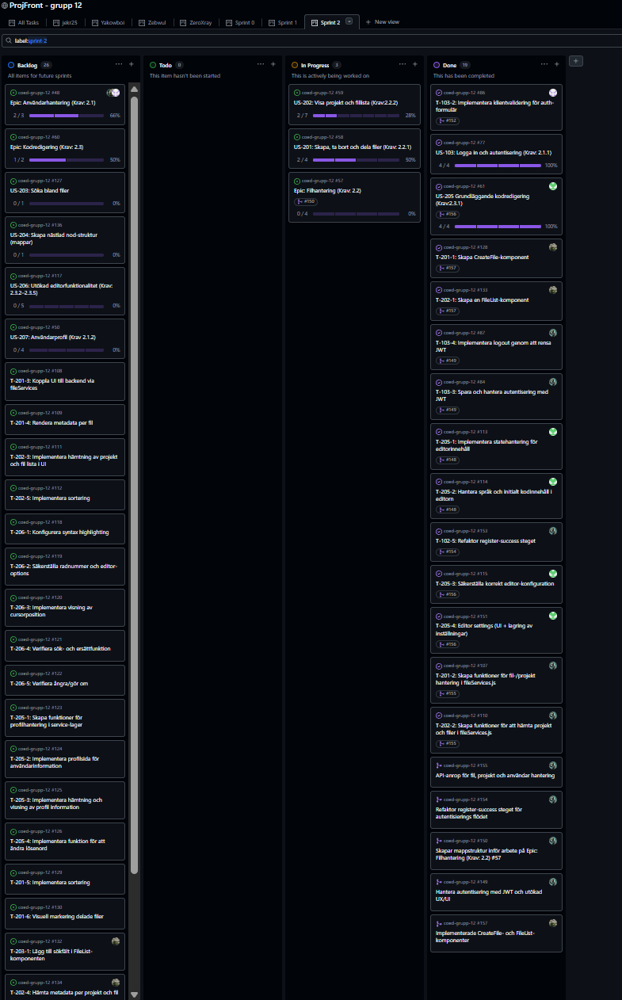

# Sprint 2 - Gruppuppgift

## 1. Sprint Planning

### Sprintmål

Målet är att göra klart autentisering (inloggning och utloggning), samt skapa en fungerande kod editor med stöd för filhantering och grundläggande editor inställningar.

### Valda User Stories

US-103, US-201, US-202, US-203, US-205

### Tasks

- T-103-2, T-103-3, T-103-4
- T-201-1, T-201-2, T-201-3, T-201-4
- T-202-1, T-202-2, T-202-3, T-202-4, T-202-5, T-202-6, T-202-7
- T-203-1, T-203-2, T-203-3, T-203-4, T-203-5
- T-205-1, T-205-2, T-205-3, T-205-4

### Fördelning

Vi har kört på fri fördelning och först till kvarn på samtliga tasks i backloggen. Då vi alla arbetar under olika tider/dagar i veckan så vill vi inte låsa upp tasks genom att “paxxa” tasks som kan blockera för fortsättning för andra. Därför låter vi backlogen vara fri för vem som helst att påbörja en task när den har tid.

### Estimering

Tidsestimering finns här under flik “Sprint 2”: https://docs.google.com/spreadsheets/d/1C4emn6hofD2PmGw2cUFbroMHP918EOgcrvQGSVOMWcU/edit?gid=0#gid=0

### Acceptanskriterer

#### US-103:

- Givet att man har ett konto,
  När jag är på sidan ska det finnas en tydlig knapp längst uppe som man kan klicka på,
  Då ska en popup med ett login formulär visas så att jag kan logga in.

- Givet att man har ett konto,
  När jag klickar på logga in,
  Då ska jag kunna komma åt min arbetsyta.

- Givet att man är inloggad,
  När jag vill logga ut från kontot,
  Då ska det finnas en "logga ut" knapp längst uppe som loggar ut mig.

- Givet att man har filer på sitt konto,
  När jag är utloggad från sidan,
  Då ska man inte kunna nå filerna på sidan om inte man är inloggad.

- Givet att jag skriver en ogiltig email eller lösenord,
  När jag försöker logga in
  Då ska felmeddelanden visas.

#### US-201:

- Givet att jag är inloggad
  När jag trycker på knappen "New Project"
  Då ska en projektmapp skapas som jag kan namnge

- Givet att jag har skapat ett projekt
  När jag trycker på knappen "New file"
  Då ska en fil skapas som ska kunna namnges

- Givet att i mitt projekt finns en fil som jag vill ta bort
  När jag klickar på "Delete"
  Då ska ett fönster visas för att bekräfta borttagning

- Givet att jag bekräftar borttagning av vald fil
  När jag tar bort filen
  Då ska filen försvinna permanent

- Givet att jag är inloggad och äger/har skapat ett projekt
  När jag trycker på knappen "Share"
  Då ska jag ett formulär visas där jag kan fylla i epostadress till den jag vill dela projektet med

#### US-202:

- Givet att jag är inloggad,
  När jag trycker på knappen "Load Project",
  Då ska det valda projektet läsas in med tillhörande filer.

- Givet att jag inte har något projekt,
  När jag trycker på knappen "Load Projekt",
  Då ska man bli erbjuden att skapa ett projekt.

- Givet att jag inte är inloggad,
  När jag kollar på sidan,
  Då ska inga filer eller projekt vara listade.

- Givet att jag inte är inloggad,
  När jag försöker klicka på "Load Project",
  Då ska den inte vara aktiv.

- Givet att jag har skapat projekt eller filer
  När jag klickar på ett projekt eller fil
  Då ska projektet eller filen öppnas i code-editor

- Givet att jag har delat ett projekt eller fil
  När jag navigerar min fil-lista
  Då ska det tydligt framgå vilka projekt eller mappar som är delade

#### US-203:

- Givet att jag befinner mig i ett projekt med flera filer
  När jag skriver i sökfältet
  Då filtreras fillistan i realtid baserat på filnamn

- Givet att jag skriver en sökterm
  När det finns matchande filer
  Då visas endast filer vars namn innehåller söktermen

- Givet att jag skriver en sökterm
  När inga filer matchar
  Då visas ett meddelande: "Inga filer hittades"

- Givet att jag klickar på en fil i resultatet
  Då öppnas filen i editorn

#### US-205:

- Givet att jag vill välja vilket kod språk jag ska programmera i,
  När jag klickar på knappen för att byta språk,
  Då ska ska detta språk sättas som aktivt språk i Monaco Editorn

- Givet att vill anpassa min kod editor med lite personliga inställningar,
  När jag ställt in dessa inställningar.
  Då ska de fungera.

- Givet att byter språk,
  När jag klickar på knappen,
  Då ska ett kort kod exempel för det språket sättas i kod editorn.

### Trello: Förebilder

### Trello: Efterbilder

Efter att vi börjat med tidsestermerings filen så tyckte vi denna trello tavla blev lite överflödig, därför minskade uppdateringen av denna tavla.

### Github-projects förebild:

### Github-projects efterbild:

## 2. Leveransdokumenation

### Färdigställda user stories

- US-103: Logga in och autentisiering (krav: 2.1.1)
- US-205: Grundläggande kodredigering (krav:2.3.1)

### Färdigställda tasks

- T-103-2: Implementera klientvaliderign för auth-formulär
- T-103-4: Implementera logout genom att rensa JWT
- T-103-3: Spara och hantera autentisiering med JWT
- T-102-5: Refaktor register-success steget
- T-201-1: Skapa CreateFile-komponent
- T-201-2: Skapa en FileList-komponent
- T-205-2: Hantera språk och initialt kodinnehåll i editiorn
- T-201-2: Skapa funktioner för fil-/projekt hantering i fileServices.js
- T-202-2: Skapa funktioner för att hämta projekt och filer i fileServices.js
- T-205-1: Implementera State hantering för editorinnehåll
- T-205-2: Hantera språk och initialt kodinnehåll i editorn
- T-205-3: Säkerställa korrekt editor-konfiguration
- T-205-4: Editor settings (UI + lagring av inställningar)

### Fördelning - vem ansvarade för vad?

- Jenny:
  T-103-2
- Niklas:
  T-103-3, T-103-4, T-201-2, T-202-2, T-102-5
- Arian:
  T-201-1, T-202-1
- Zebastian:
  T-205-1, T-205-2, T-205-3 och T-205-4

### Tidsutfall - Hur många timmar per task?

- T-103-2: 6 timmar
- T-103-3: 1 timme
- T-103-4: 2 timmar
- T-102-5: 2 timmar (Denna låg inte med i den ursprungliga planeringen)
- T-201-1: 4 timmar
- T-201-2: 6 timmar
- T-202-2: 3 timmar
- T-205-1: 4 timmar
- T-205-2: 4 timmar
- T-205-3: 3 timmar
- T-205-4: 6 timmar (Denna låg inte med i den ursprungliga planeringen)

## Definition of Done

### Definition of Done - Team 12

En user story anses vara klar när samtliga kriterier nedan är uppfyllda.

#### Funktionalitet & krav

- Funktionen **uppfyller** sin user stories **acceptance criteria**

### Spårbarhet & planering

- User story har **rätt namngivning** och task kan **spåras till user story**
- Tidsestimering och **tidsrapport** för task är **dokumenterad**

### Kodkvalitet

- Koden **fungerar** lokalt **utan fel**
- **Felhantering** är implementerad **där det är relevant**

### Dokumentation

- README är uppdaterad när det behövs

### Kodgranskning & leverans

- **PR**-beskrivningen **förklarar vad** som gjorts och **kopplar till en user story**
- **Minst en** annan gruppmedlem **har granskat** och godkänt PR:en
- Koden är mergad till main

### Kodstandard

- Koden följer gruppens kodkonventioner:
  - Commits, kod & filnamn: Engelsk text
  - Brödtext i ex Trello/PR/Code-review: Svensk text
  - React, jsx-filer: PascalCase
  - js-filer, variabler, props: camelCase
  - CSS, SASS: kebab-case
  - mappar: lowercase

## 3. Sprint retrospective

**Vad fungerade bra? T ex vad ni är nöjda med — tekniskt, processmässigt eller samarbetsmässigt?**

Vi tycker det är bra med daily standup och att vi bör fortsätta med dessa möten. Vi är duktiga på att vara flexibla för varandras scheman. Vi är också duktiga på att stötta upp varandra och få arbetet att fortgå även om vi inte kan samlas allihop i ett möte eller om vi upplever motgångar i arbetsuppgifter eller i livet i allmänhet. Processen är att vi uppdaterar varandra i discord när någon inte varit närvarande så att alla lätt kan uppdatera sig.

**Vad fungerade mindre bra?
Vad skapade friktion, förseningar eller frustration? Var ärliga — retrospektivet är ett verktyg för förbättring, inte en värdering av gruppen**

Vi har inte riktigt kommit igång med daily standup på det sätt som vi kommit överens om i förra sprint retrospective. Vi ska därför jobba med att tydligare fokusera på daily standup under 30 min vilket innebär att vi under denna tid kör bordet runt att besvara vad vi tänkt göra idag och identifierare om det finns blockerare. Eventuella blockerare ska inte diskuteras under daily standup utan man kommer istället överens om vilka som kan lösa dem tillsammans efter mötet. Ett nytt arbetsmöte startas för att jobba med andra uppgifter och ska inte ingå i daily standup.

**Vad gör vi annorlunda nästa sprint?
Formulera minst en konkret åtgärd — inte bara en insikt. En åtgärd är något ni faktiskt kan följa upp: vad ska göras, av vem och när?**

Vi kan bli ännu bättre på att sammanfatta:

- vad var och en ska göra under dagen i daily update

- eller ta mötesanteckningar vad som gjorts under ett arbetsmöte om det kan gynna övriga gruppmedlemmar att veta vad som diskuterats.

Detta görs genom att om någon inte varit närvarande i daily standup eller ett arbetsmöte:

- Daily standup: Alla uppdaterar var och en i discord daily update enligt vår mall, vilket innebär att även de som inte deltagit i mötet skriver en kort uppdatering samt ifall de inte alls kan göra något pga upptagen med annat

- Övriga möten: Sammanfatta tillsammans vad som sagt och gjorts i mötet som kan gynna övriga gruppmedlemmar

Vi kan bli mer strukturerade i hur vi i förväg delar eventuell närvaro/frånvaro i daily standup. Vi kan också på ett mer strukturerat sätt dela vilka tider vi är tillgängliga för arbete kommande sprint.

Detta struktureras från nästa sprint (sprint 3) tydligare genom att vi fyller i en flik i vårt delade Google Sheets-dokument istället för att skriva i chatten.

## 4. Tidloggning & estimering

**Hur väl stämde gruppens samlade tidsestimat med inloggad tid under sprinten? Lyft ett konkret exempel på en uppgift som tog mer eller mindre tid än estimerat och diskutera vad det berodde på.**

Ett exempel på uppgift som tagit längre tid än planerat är task T-103-2: Implementera klientvalidering för auth-formulär. Vi hade som grupp estimerat att den skulle ta 6 timmar att genomföra. När 6 h var gjord kändes det som att uppgiften till stor del var genomförd men skattades om till att kräva 2 timmar till med tanke på lite fix och att PR ska skapas och att instruktion för test skulle skrivas. Men det som var kvar att skriva kod för tog lite mer tid och krävde bättre förståelse av bland annat useState i React. Vi behövde också som grupp komma överens om vad som var bästa lösningen för felutskrift och om lösningen blev tillräckligt bra enligt gruppen. Efter lite dialog fick vi till en bra lösning för felutskrift utanför standardvalideringen i form-elementet. PR gjordes men i code review kom det tillbaka väldigt bra feedback och utvecklingspotential. Även detta tog ett par extra timmar ytterligare. Under denna tid löste sig alla feedback-punkter förutom en del som var extra klurig. Denna extra kluriga del tog två timmar för två gruppmedlemmar att lösa genom att gemensamt diskutera fram en möjlig lösning. Därefter godkändes och mergades denna PR. Det blev totalt 14 timmar, då vi delvis var mer än en deltagare, för att lösa uppgiften. Den hade estimerats till 6 timmar som tidigare nämnts.

**Vad tar ni med er i nästa sprints planering?**

Något vi tar med oss är att man gärna uppskattar tiden för kort mot vad det tar att göra en uppgift i verkligheten.Vi tar med oss att det är svårt att göra en heltäckande planering. Det är exempelvis svårt att förutse alla delmoment i detalj och se alla hinder eller utmaningar i förväg som kan uppkomma på vägen mot en löst uppgift. Det är även viktigt att planera in tid till code review och att det kan behövas tid till att göra justeringar utifrån code review, vilket vi har underskattat något denna sprint.
