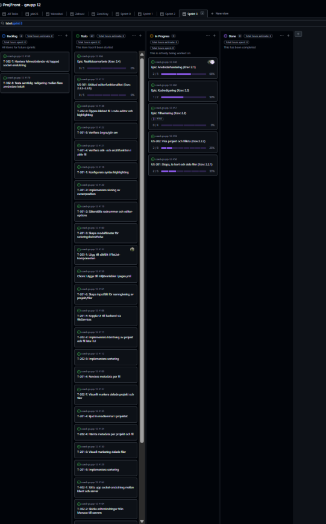
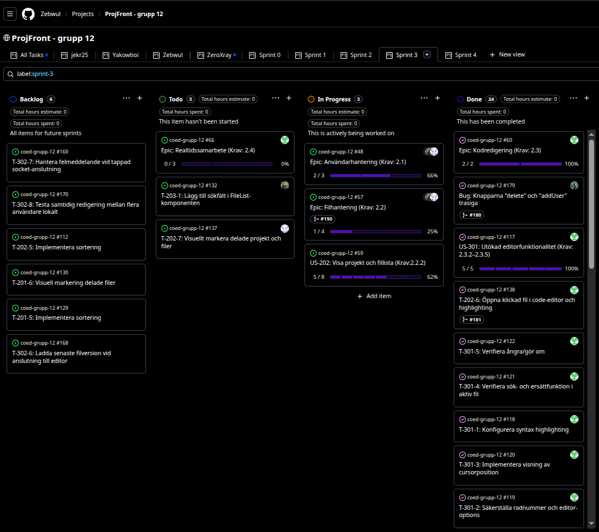

# Sprint 2 - Gruppuppgift

## 1. Sprint Planning

### Sprint mål

Målet är att göra klart filhantering, spara, läsa, visa, öppna filer samt göra klart editor funktionaliteten. Utöver det så är målet att börja med realtids-samarbete via socket-io.

### Valda user stories

Vi fortsätter med User Stories från förra sprinten som vi inte hann klart med:

- US-201: Skapa, ta bort och dela filer (Krav: 2.2.1)
- US-202: Visa projekt och fillista (Krav:2.2.2)

De nya User Stories som vi börjar med är:

- US-301: Utökad editorfunktionalitet (Krav: 2.3.2–2.3.5)
- US-302: Samtidig redigering (Krav: 2.4.1)

### Tasks

- T-201-3: Koppla UI till backend via fileServices
- T-201-4: Bjud in medlemmar i projektet
- T-201-5: Skapa modala fönster för radering bekräftelse
- T-201-6: Skapa input fält för namngivning av projekt/filer
- T-201-7: Skapa funktioner för användarhantering i userServices.js (tillkom under sprint 3)

- T-202-3: Implementera hämtning av projekt och fillista i UI
- T-202-4: Hämta metadata per projekt och fil
- T-202-5: Implementera sortering
- T-202-6: Öppna klickade fil i code-editor och highlighting
- T-202-7: Visuellt markera delade projekt och filer

- T-301-1: Konfigurera syntax highlighting med fil-ändelse
- T-301-2: Säkerställa radnummer och editor-options
- T-301-3: Implementera visning av cursor position
- T-301-4: Verifiera sök- och ersätt funktion i aktiv fil
- T-301-5: Verifiera ångra/gör om

- T-302-1: Sätta upp socket-anslutning mellan klient och server
- T-302-2: Skicka editor ändringar från Monaco till servern
- T-302-3: Implementera mottagning av realtidsuppdateringar i klienten
- T-302-4: Synkronisera editor innehåll mellan flera klienter
- T-302-5: Säkerställa korrekt syntax highlighting efter externa ändringar
- T-302-6: Ladda senaste filversion vid anslutning till edito

### Fördelning

Vi har kört på fri fördelning och först till kvarn på samtliga tasks i backloggen. Samtal gällande fördelning har skett kontinuerligt och fortlöpande, då vi alla arbetar under olika tider/dagar i veckan så vill vi inte låsa upp tasks genom att “paxxa” tasks som kan blockera för fortsättning för andra. Därför låter vi backloggen vara fri för vem som helst att påbörja en task när den har t

### Estimering

Estimering finns här i fliken Sprint 3:
https://docs.google.com/spreadsheets/d/1C4emn6hofD2PmGw2cUFbroMHP918EOgcrvQGSVOMWcU/edit?gid=0#gid=0

### Acceptanskriterier

#### 201:

- Givet att jag är inloggad
  När jag trycker på knappen "New Project"
  Då ska en projektmapp skapas som jag kan namnge

- Givet att jag har skapat ett projekt
  När jag trycker på knappen "New file"
  Då ska en fil skapas som ska kunna namnges

- Givet att i mitt projekt finns en fil som jag vill ta bort
  När jag klickar på "Delete"
  Då ska ett fönster visas för att bekräfta borttagning

- Givet att jag bekräftar borttagning av vald fil
  När jag tar bort filen
  Då ska filen försvinna permanent

- Givet att jag är inloggad och äger/har skapat ett projekt
  När jag trycker på knappen "Share"
  Då ska jag ett formulär visas där jag kan fylla i e postadress till den jag vill dela projektet med

#### 202:

- Givet att jag är inloggad,
  När jag trycker på knappen "Load Project",
  Då ska det valda projektet läsas in med tillhörande filer.

- Givet att jag inte har något projekt,
  När jag trycker på knappen "Load Projekt",
  Då ska man bli erbjuden att skapa ett projekt.

- Givet att jag inte är inloggad,
  När jag kollar på sidan,
  Då ska inga filer eller projekt vara listade.

- Givet att jag inte är inloggad,
  När jag försöker klicka på "Load Project",
  Då ska den inte vara aktiv.

- Givet att jag har skapat projekt eller filer
  När jag klickar på ett projekt eller fil
  Då ska projektet eller filen öppnas i code-editor

- Givet att jag har delat ett projekt eller fil
  När jag navigerar min fil-lista
  Då ska det tydligt framgå vilka projekt eller mappar som är delade

#### 301:

- Givet att jag har öppnat en fil i editorn  
  När filen visas i Monaco-editorn  
  Då ska koden visas med syntax- highlighting baserat på filtyp, till exempel HTML, CSS eller JavaScript.

- Givet att jag har öppnat en fil i editorn  
  När jag skriver eller navigerar i koden  
  Då ska editorn visa radnummer och använda konfigurerade editor-options som gör koden lättare att läsa och redigera.

- Givet att jag har markören placerad i editorn  
  När jag flyttar markören till en annan plats i koden  
  Då ska aktuell rad och kolumn för markörens position visas i gränssnittet.

- Givet att jag har en aktiv fil öppen i editorn  
  När jag använder sök- eller ersätt funktionen  
  Då ska jag kunna hitta och ersätta text i den aktiva filen.

- Givet att jag har gjort en ändring i koden  
  När jag använder ångra eller gör om  
  Då ska editorn återställa eller återskapa ändringen korrekt i den aktiva filen.

#### 302:

- Givet att flera användare har öppnat samma fil  
  När en användare gör en ändring i editorn  
  Då ska ändringen visas för övriga användare i realtid.

- Givet att två eller fler användare redigerar samma fil samtidigt  
  När ändringar skickas mellan klienterna  
  Då ska filens innehåll hållas synkroniserat mellan alla användare.

- Givet att en användare får ändringar från en annan användare  
  När innehållet uppdateras i Monaco-editorn  
  Då ska syntax- och editors rendering uppdateras korrekt.

- Givet att en användare ansluter till en redan öppen fil  
  När filen laddas in  
  Då ska användaren få den senaste versionen av filens innehåll.

- Givet att anslutningen till realtids servern bryts  
  När användaren försöker fortsätta redigera  
  Då ska användaren få feedback om att real tidssynkronisering inte fungerar.

#### GitHub Projects Start

## 2. Leveransdokumentation

[Länk till GitHub Pages](https://zebwul.github.io/coed-grupp-12/)

### Färdigställda user stories

- US-301: Utökad editorfunktionalitet (Krav: 2.3.2–2.3.5)
- US-201: Skapa, ta bort och dela filer (Krav: 2.2.1)

### Färdigställda Tasks

Niklas:

- T-202-3: Implementera hämtning av projekt och fil lista i UI
- T-201-3: Koppla UI till backend via fileServices
- Bug: Knapparna "delete" och "addUser" trasiga

Jenny:

- T-201-4: Bjud in medlemmar i projektet
- T-201-7: Skapa funktioner för användarhantering i userServices.js

Arian:

- T-201-5: Skapa modalfönster för raderingsbekräftelse
- T-202-4: Hämta metadata per projekt och fil
- Chore: Lägga till miljövariabler i pages.yml
- Chore: Refaktorera om sidebaren
- T-201-6: Skapa inputfält för namngivning av projekt/filer

Zebastian:

- T-202-6: Öppna klickade fil i code-editor och highlighting
- T-301-1: Konfigurera syntax highlighting med fil-ändelse
- T-301-2: Säkerställa radnummer och editor-options
- T-301-3: Implementera visning av cursorposition
- T-301-4: Verifiera sök- och ersättfunktion i aktiv fil
- T-301-5: Verifiera ångra/gör om
- T-302-1: Sätta upp socket-anslutning mellan klient och server
- T-302-2: Skicka editor ändringar från Monaco till servern
- T-302-3: Implementera mottagning av realtidsuppdateringar i klienten
- T-302-4: Synkronisera editorinnehåll mellan flera klienter
- T-302-5: Säkerställa korrekt syntax highlighting efter externa ändringar

### Påbörjade men ej färdigställda tasks

Niklas:

- N/A

Jenny:

- T-202-7: Visuellt markera delade projekt och filer

Arian:

- N/A

Zebastian:

- N/A

### Tidsutfafall

Tidsutfall finns här under flik “Sprint 3”: https://docs.google.com/spreadsheets/d/1C4emn6hofD2PmGw2cUFbroMHP918EOgcrvQGSVOMWcU/edit?gid=0#gid=0

### Definition of Done - Team 12

En user story anses vara klar när samtliga kriterier nedan är uppfyllda.

#### Funktionalitet & krav

- Funktionen **uppfyller** sin user stories **acceptance criteria**

### Spårbarhet & planering

- User story har **rätt namngivning** och task kan **spåras till user story**
- Tidsestimering och **tidsrapport** för task är **dokumenterad**

### Kodkvalitet

- Koden **fungerar** lokalt **utan fel**
- **Felhantering** är implementerad **där det är relevant**

### Dokumentation

- README är uppdaterad när det behövs

### Kodgranskning & leverans

- **PR**-beskrivningen **förklarar vad** som gjorts och **kopplar till en user story**
- **Minst en** annan gruppmedlem **har granskat** och godkänt PR:en
- Koden är mergad till main

### Kodstandard

- Koden följer gruppens kodkonventioner:
  - Commits, kod & filnamn: Engelsk text
  - Brödtext i ex Trello/PR/Code-review: Svensk text
  - React, jsx-filer: PascalCase
  - js-filer, variabler, props: camelCase
  - CSS, SASS: kebab-case
  - mappar: lowercase

#### GitHub Projects Slut

## 3. Sprint retrospective

### Vad fungerade bra?

Vi har haft väldigt bra energi och är mycket kreativa i gruppen, vilket vi vill fortsätta att bygga vidare på. Vi har också fått klart största delen av grundstrukturen på plats, vilket vi är väldigt nöjda med.

### Vad fungerade mindre bra?

Vi är överens om att vi inte alltid efterlever de beslut som är tagna. Vi har pratat om att vi kanske sätter målen lite för högt och behöver hitta en medelväg för vad som ska göras. Om uppslutningen på möten hade varit bättre och alla hade samlats oftare så hade behovet av att följa processerna minskat eftersom uppdateringen då görs direkt i våra möten. Det har exempelvis varit lite otydligheter kring om daily standup ska bli av fysiskt eller inte denna sprinten.

### Vad skapade friktion, förseningar eller frustration?

Vi har sett över processen när beslut tas då inte besluten alltid efterlevts vilket gjort att vi jobbat på olika sätt. Vi har exempelvis inte jobbat på samma sätt med hur vi uppdaterar varandra med närvaro, vilket kan ha lett till frustration såsom att alla inte känt sig uppdaterade och därmed också har lett till förvirring om möten ska hållas eller ej.

Denna sprint hade även vi flera tätt kopplade tasks som var beroende av varandra, vilket resulterade i ett delvis ineffektivt arbete då det ledde till konflikter i koden som behövde lösas i efterhand.

### Vad gör vi annorlunda nästa sprint?

Vi har beslutat att alla ska gå in i vårt delade exceldokument och uppdatera när man är tillgänglig för arbete i gruppen och när man ska delta i daily standup. Då har alla ett samlat dokument att titta i och alla är uppdaterade kring vem som är tillgänglig och när. Detta för att vi ska kunna fortsätta vara flexibla med alla gruppens medlemmars tider. Vi vill också i förhand ha tiderna för sprint planning och sprint retrospective planerade så att så många kan vara med som möjligt. Sprint retrospective ska därför göras efter lunch på torsdagen när sprint review är klar. Då kan alla närvara.

Vi har också beslutat att oftare skriva kommentarer i koden så det blir lättare för övriga gruppmedlemmar att läsa och förstå.

Det finns olika sätt att undvika för stora konflikter när vi jobbar i tight sammankopplade tasks. Vi kommer att se över om vi om möjligt i större utsträckning kan jobba i olika filer istället för att flera personer jobbar och gör ändringar i samma filer. Vi kommer också försöka merga koden vi jobbar i oftare och skapa fler men mindre PRs samt försöka göra tasken mindre för att öka sannolikheten att vi har mer lika kod i vårt löpande arbete.

## 4. Tidloggning & estimering

### Hur väl stämde gruppens samlade tidsestimat med loggad tid under sprinten?

Majoriteten av tasksen stämde med estimeringen. Men vi hade över estimerat tiden på US 301 och det tog oss kortare tid att färdigställa dessa fem tasks kopplade till denna US. Detta kom av att många av de tasks vi skapade och estimerade helt enkelt kommer med i monaco-biblioteket.

Vi hade också några få tasks som vi underestimerade tiden på då de var mer komplexa än vi vid första anblick hade räknat med. Vi reflekterade efteråt kring att dessa tasks till och med skulle kunna ha varit egna user stories.

### Vad tar ni med er i nästa sprintplanering?

Vi kommer att kraftsamla på att bryta ner kravspecen i fler userstories med flera, mindre tasks där vi strävar mot att varje task högst kan ta 3 timmar att färdigställa samt 1 timme för codereview och merge till main samt annan daglig rutinverksamhet (daily standups, tidrapport, mm).
