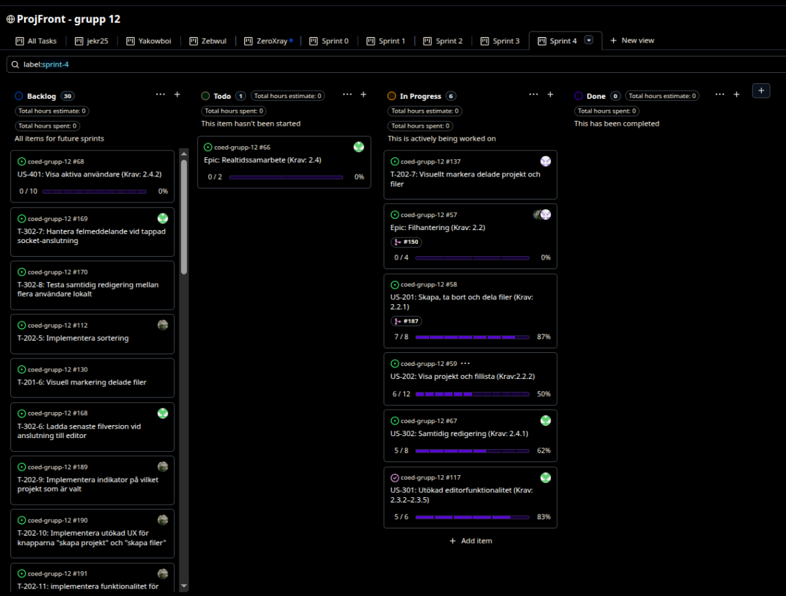
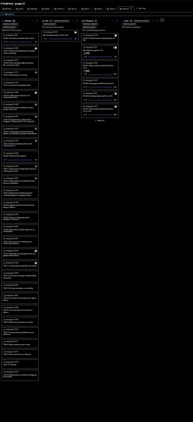
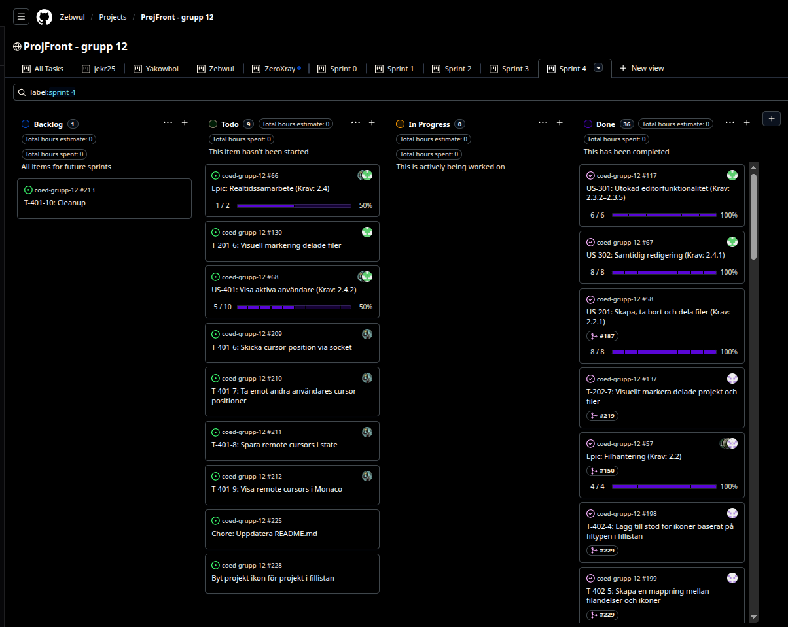
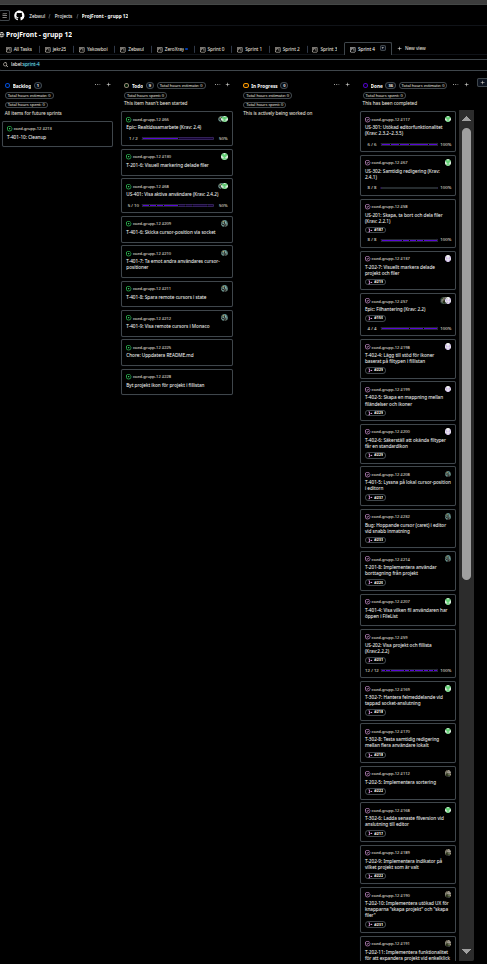

# Sprint 4 - Gruppuppgift

## 1. Sprint Planning

### Sprint mål

Denna sprint har målet främst varit att färdigställa en MVP, och i andra hand färdigställa så många medium tasks som möjligt. Målet har också varit att se över kodbasen samt förfina funktionerna och UI.

### Valda user stories

- US-201: Skapa, ta bort och dela filer (Krav: 2.2.1)
- US-202: Visa projekt och fillista (Krav:2.2.2)
- US-301: Utökad editorfunktionalitet (Krav: 2.3.2–2.3.5)
- US-302: Samtidig redigering (Krav: 2.4.1)
- US-401: Visa aktiva användare (Krav: 2.4.2)
- US-402: Filträd och File explorer (Krav: 2.2.3)

### Tasks

- T-201-8: Implementera användar borttagning från projektet
- T-202-5: Implementera sortering
- T-202-7: Visuellt markera delade projekt och filer
- T-202-9: Implementera indikator på vilket projekt som är valt
- T-202-10: Implementera utökade UX för knapparna "skapa projekt" och "skapa filer"
- T-202-11: Implementera funktionalitet för att expandera projekt vid enkelklick i deleteMode
- T-202-12: Flytta metadata funktioner till fileServices.js
- T-301-7: Säkerställ att undo/redo inte sker globalt mellan filerna
- T-302-6: Ladda senaste filversion vid anslutning till editor
- T-302-7: Hantera felmeddelande vid tappad socket-anslutning
- T-302-8: Testa samtidig redigering mellan flera användare lokalt
- Task: Refaktorera editor-state till state per fil istället för globalt state
- T-401-1: Ta emot aktiva användare från socket
- T-401-2: Visa aktiva användare i EditorToolbar med namn
- T-401-3: Ge varje användare en unik färg
- T-401-4: Visa vilken fil användaren har öppen i FileList
- T-401-5: Lyssna på lokal cursor-position i editorn
- T-401-6: Skicka cursor-position via socket
- T-401-7: Ta emot andra användares cursor-positioner
- T-401-8: Spara remote cursors i state
- T-401-9: Visa remote cursors i Monaco
- T-401-10: Cleanup
- T-402-1:Implementera validering för filnamn vid skapande av filer
- T-402-2: Skapa logik för att identifiera filtyp baserat på filändelse
- T-402-3: Implementera felhantering och användarfeedback vid ogiltiga filnamn
- T-402-4: Lägg till stöd för ikoner baserat på filtypen i fillistan
- T-402-5: Skapa en mappning mellan filändelser och ikoner
- T-402-6: Säkerställ att okända filtyper får en standardikon
- T-402-7:Skriva tester för validering och rendering av filikoner

### Fördelning

Vi har kört på fri fördelning och först till kvarn på samtliga tasks i backloggen. Samtal gällande fördelning har skett kontinuerligt och fortlöpande, då vi alla arbetar under olika tider/dagar i veckan så vill vi inte låsa upp tasks genom att “paxxa” tasks som kan blockera för fortsättning för andra. Därför låter vi backloggen vara fri för vem som helst att påbörja en task när den har tid.

### Estimering

Estimering finns här i fliken Sprint 4:
https://docs.google.com/spreadsheets/d/1C4emn6hofD2PmGw2cUFbroMHP918EOgcrvQGSVOMWcU/edit?gid=0#gid=0

### Acceptanskriterier

#### Acceptanskriterier US-201

- Givet att jag är inloggad
  När jag trycker på knappen "New Project"
  Då ska en projektmapp skapas som jag kan namnge

- Givet att jag har skapat ett projekt
  När jag trycker på knappen "New file"
  Då ska en fil skapas som ska kunna namnges

- Givet att i mitt projekt finns en fil som jag vill ta bort
  När jag klickar på "Delete"
  Då ska ett fönster visas för att bekräfta borttagning

- Givet att jag bekräftar borttagning av vald fil
  När jag tar bort filen
  Då ska filen försvinna permanent

- Givet att jag är inloggad och äger/har skapat ett projekt
  När jag trycker på knappen "Share"
  Då ska jag ett formulär visas där jag kan fylla i epostadress till den jag vill dela projektet med

#### Acceptanskriterier US-202

- Givet att jag är inloggad,
  När jag trycker på knappen "Load Project",
  Då ska det valda projektet läsas in med tillhörande filer.

- Givet att jag inte har något projekt,
  När jag trycker på knappen "Load Projekt",
  Då ska man bli erbjuden att skapa ett projekt.

- Givet att jag inte är inloggad,
  När jag kollar på sidan,
  Då ska inga filer eller projekt vara listade.

- Givet att jag inte är inloggad,
  När jag försöker klicka på "Load Project",
  Då ska den inte vara aktiv.

- Givet att jag har skapat projekt eller filer
  När jag klickar på ett projekt eller fil
  Då ska projektet eller filen öppnas i code-editor

- Givet att jag har delat ett projekt eller fil
  När jag navigerar min fil-lista
  Då ska det tydligt framgå vilka projekt eller mappar som är delade

#### Acceptanskriterier US-301

- Givet att jag har öppnat en fil i editorn  
  När filen visas i Monaco-editorn  
  Då ska koden visas med syntax highlighting baserat på filtyp, till exempel HTML, CSS eller JavaScript.

- Givet att jag har öppnat en fil i editorn  
  När jag skriver eller navigerar i koden  
  Då ska editorn visa radnummer och använda konfigurerade editor-options som gör koden lättare att läsa och redigera.

- Givet att jag har markören placerad i editorn  
  När jag flyttar markören till en annan plats i koden  
  Då ska aktuell rad och kolumn för markörens position visas i gränssnittet.

- Givet att jag har en aktiv fil öppen i editorn  
  När jag använder sök- eller ersättfunktionen  
  Då ska jag kunna hitta och ersätta text i den aktiva filen.

- Givet att jag har gjort en ändring i koden  
  När jag använder ångra eller gör om  
  Då ska editorn återställa eller återskapa ändringen korrekt i den aktiva filen.

#### Acceptanskriterier US-302

- Givet att flera användare har öppnat samma fil  
  När en användare gör en ändring i editorn  
  Då ska ändringen visas för övriga användare i realtid.

- Givet att två eller fler användare redigerar samma fil samtidigt  
  När ändringar skickas mellan klienterna  
  Då ska filens innehåll hållas synkroniserat mellan alla användare.

- Givet att en användare får ändringar från en annan användare  
  När innehållet uppdateras i Monaco-editorn  
  Då ska syntax highlighting och editorns rendering uppdateras korrekt.

- Givet att en användare ansluter till en redan öppen fil  
  När filen laddas in  
  Då ska användaren få den senaste versionen av filens innehåll.

- Givet att anslutningen till realtidsservern bryts  
  När användaren försöker fortsätta redigera  
  Då ska användaren få feedback om att realtidssynkronisering inte fungerar.

#### Acceptanskriterier US-401

- Givet att jag är inloggad och är en projektmedlem
  När jag är aktiv samtidig som andra projektmedlemmar
  Då ska vi kunna se vem som är aktiv i vilken fil

- Givet att jag är inloggad och är en projektmedlem
  När jag är aktiv i en fil samtidigt som en annan projektmedlem
  Då ska vi har vars en markör och de ska ha olika färg

- Givet att jag är inloggad och är en projektmedlem
  När jag klickar och markerar ett projekt som aktivt projekt
  Då ska det visas vilka andra projektmedlemmar som också är aktiva i projektet

#### Acceptanskriterier US-402

- Givet att jag skapar en ny fil
  När jag anger ett filnamn utan giltig filändelse
  Då ska jag få ett valideringsmeddelande som informerar om att en filändelse krävs

- Givet att jag skapar en ny fil
  När jag anger ett filnamn med en giltig filändelse som .js, .html eller .css
  Då ska filen kunna skapas

- Givet att det finns filer i projektets fillista
  När filerna visas i gränssnittet
  Då ska varje fil visas med en ikon som motsvarar dess filtyp

- Givet att en filtyp inte har någon specifik ikon
  När filen visas i fillistan
  Då ska en standardikon visas

#### GitHub Projects Start

## 2. Leveransdokumentation

[Länk till GitHub Pages](https://zebwul.github.io/coed-grupp-12/)

### Färdigställda user stories

- US-301: Utökad editorfunktionalitet (Krav: 2.3.2–2.3.5)
- US-402: Filträd och File explorer

Nedanstående Userstories öppnade vi på nytt då vi skapade nya tasks i dem där vi såg behov att utöka funktionaliteten inom ramen för vad Userstorien avsåg:

- US-201: Skapa, ta bort och dela filer (Krav: 2.2.1)
- US-202: Visa projekt och fillista (Krav:2.2.2)
- US-302: Samtidig redigering (Krav: 2.4.1)

### Färdigställda Tasks

Niklas:

- T-201-8: Implementera användar borttagning från projektet
- T-401-5: Lyssna på lokal cursor-position i editorn
- Chore: Refaktorering av mappstruktur
- Bug: Hoppande cursor (caret) i editor vid snabb inmatning

Jenny:

- T-202-7: Visuellt markera delade projekt och filer
- T-402-4: Lägg till stöd för ikoner baserat på filtypen i fillistan
- T-402-5: Skapa en mappning mellan filändelser och ikoner
- T-402-6: Säkerställ att okända filtyper får en standardikon

Arian:

- T-202-5: Implementera sortering
- T-202-9: Implementera indikator på vilket projekt som är valt
- T-202-10: Implementera utökade UX för knapparna "skapa projekt" och "skapa filer"
- T-202-11: Implementera funktionalitet för att expandera projekt vid enkelklick i deleteMode
- T-202-12: Flytta metadata funktioner till fileServices.js
- T-402-1: Implementera validering för filnamn vid skapande av filer
- T-402-2: Skapa logik för att identifiera filtyp baserat på filändelse
- T-402-3: Implementera felhantering och användarfeedback vid ogiltiga filnamn

Zebastian:

- T-302-6: Ladda senaste filversion vid anslutning till editor
- T-302-7: Hantera felmeddelande vid tappad socket-anslutning
- T-302-8: Testa samtidig redigering mellan flera användare lokalt
- Task: Refaktorera editor-state till state per fil istället för globalt state
- T-401-1: Ta emot aktiva användare från socket
- T-401-2: Visa aktiva användare i EditorToolbar med namn
- T-401-3: Ge varje användare en unik färg
- T-401-4: Visa vilken fil användaren har öppen i FileList
- Chore: Refaktorering av Mapp / komponent -struktur
- Bug: Fixar realtime-synkronisering mellan användare
- Choir: Styling för statusmeddelanden i EditorToolbar

### Påbörjade men ej färdigställda tasks

Niklas:

- T-401-6: Skicka cursor-position via socket
- T-401-7: Ta emot andra användares cursor-positioner
- T-401-8: Spara remote cursors i state
- T-401-9: Visa remote cursors i Monaco

Jenny:

- N/A

Arian:

- N/A

Zebastian:

- N/A

### Tidsutfafall

Tidsutfall finns här under flik “Sprint 4”: https://docs.google.com/spreadsheets/d/1C4emn6hofD2PmGw2cUFbroMHP918EOgcrvQGSVOMWcU/edit?gid=0#gid=0

### Definition of Done - Team 12

- Funktionen **uppfyller** sin user stories **acceptance criteria**
- User story har **rätt namngivning** och task kan **spåras till user story**
- Tidsestimering och **tidsrapport** för task är **dokumenterad**
- Koden **fungerar** lokalt **utan fel**
- **Felhantering** är implementerad **där det är relevant**
- README är uppdaterad när det behövs
- **PR**-beskrivningen **förklarar vad** som gjorts och **kopplar till en user story**
- **Minst en** annan gruppmedlem **har granskat** och godkänt PR:en
- Koden är mergad till main
- Koden följer gruppens kodkonventioner:
  - Commits, kod & filnamn: Engelsk text
  - Brödtext i ex Trello/PR/Code-review: Svensk text
  - React, jsx-filer: PascalCase
  - js-filer, variabler, props: camelCase
  - CSS, SASS: kebab-case
  - mappar: lowercase

#### GitHub Projects Slut

## 3. Sprint retrospective

### Vad fungerade bra?

Vi tycker att det fortsatt är bra samarbete och vi har haft bra kommunikation. Vi har sett till att tidigt få koll på läget för att se till att vi kan uppnå MVP, vilket har hjälpt oss hela sprinten. Vi påbörjade sprint-planning något tidigare denna sprint, vilket frigjorde mer tid. Vi kraftsamlade med målet att bli klara med sprint-planning på en dag. Det tog lite längre tid än så, men kraftsamlingen gjorde att vi tog oss framåt i arbetet snabbare.

### Vad fungerade mindre bra?

Vi har hela tiden haft en utmaning i gruppen att vi har olika scheman, och att scheman förändras över tid. Men vi har hela tiden varit överens om att vi ska vara flexibla och tagit oss igenom det.

### Vad skapade friktion, förseningar eller frustration?

Våra olika schematider kan ge upphov till friktioner och frustrationer i gruppen. Alla är engagerade och vill framåt, men när inte alla är med på ett möte blir det oftare ineffektivt och svårare att synka så alla i gruppen har en gemensam bild. Det blir svårare att planera sin egen tid när scheman krockar och förändras. Detta har egentligen varit en utmaning för oss under hela projektet.

### Vad gör vi annorlunda nästa sprint?

Eftersom nästa sprint inte har samma upplägg som sprint 1-4, väljer vi att här istället reflektera över vad vi kan ta med oss om vi skulle göra ett liknande projekt i framtiden.

Vi tar med oss att hela tiden visa upp vad vi har gjort och beskriver det som pågår och lyfter problem som kommer upp. Vi har lärt oss att processen och strukturen är viktig för ett effektivt arbetssätt. Kursen har gett oss en väldigt bra förståelse för hur man kan jobba tillsammans med kodning och vilka utmaningar som kan uppstå. Vi har hittat några sätt för att minska friktioner förenkla utmaningarna, såsom att arbeta i mindre tasks för att oftare uppdatera main och undvika merge-konflikter i så stor utsträckning som möjligt.

Ramverket för hur vi ska arbeta har jobbats fram efter hand i detta projektet. Skulle vi påbörja ett nytt projekt idag så hade vi satt upp riktlinjer och struktur direkt, såsom den översikt vi upprättade som visar samtligas tillgänglighet.

Vi reflekterade över att i arbetslivet finns ofta en formell ledare som förenklar för gruppdeltagare att förankra ett tydligt ramverk i ett inledande skede vilket skulle hjälpa gruppen att minska friktioner och öka effektivitet.

## 4. Tidloggning & estimering

### Hur väl stämde gruppens samlade tidsestimat med loggad tid under sprinten?

Denna sprint har estimeringen haft blandade utfall. Denna sprint har vi både haft uppgifter som tagit längre tid och uppgifter som gått snabbare än estimerat.

### Vad tar ni med er i nästa sprintplanering?

Vi tar med oss att estimering är svårt. Gruppen är eniga om att denna färdighet att estimera kommer med erfarenhet.
